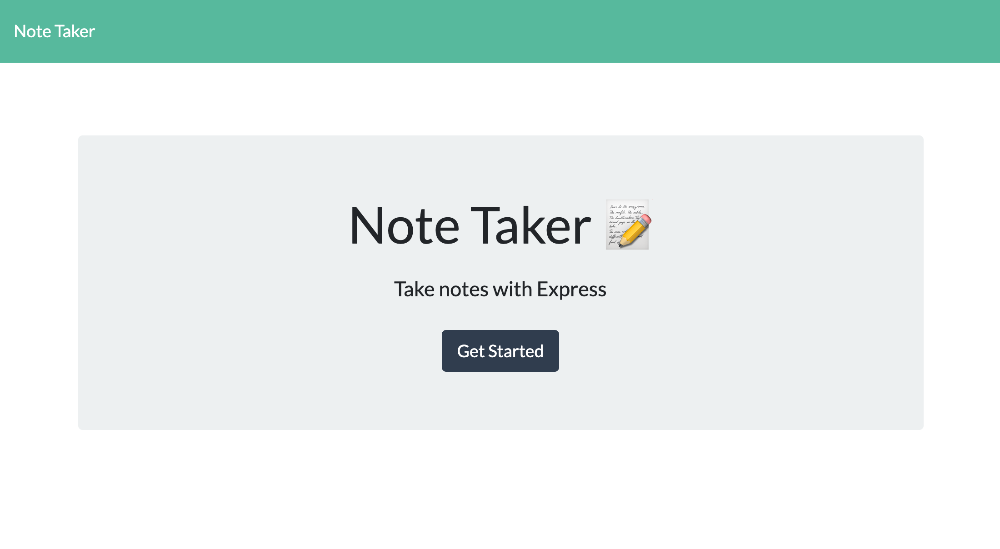
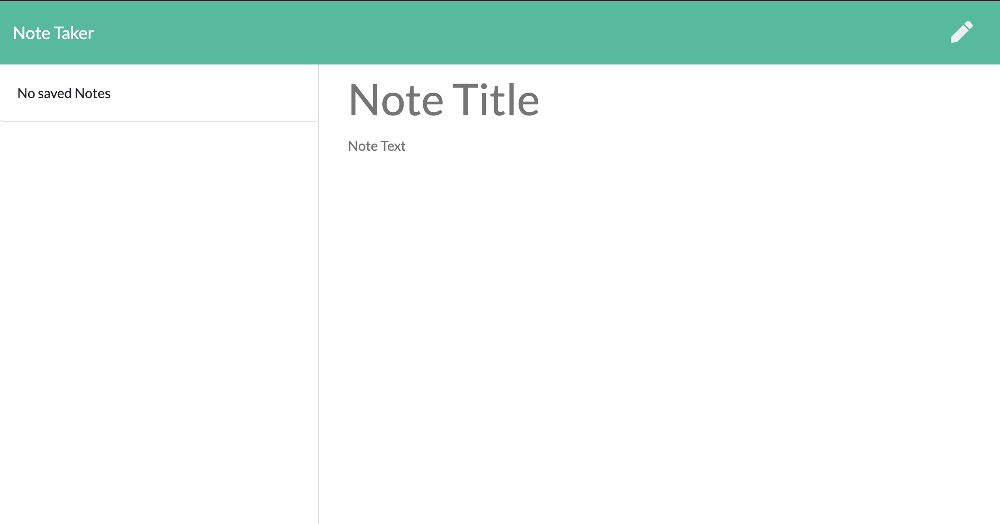

# Note Taker

[](https://opensource.org/licenses/Apache-2.0)

## Description

This application uses Node.js and Express to allow the user to have a system of taking notes. In the application, the user can write, view, save, and delete notes. 

## Table of Content

* [Installation](#installation)

* [Photos](#photos)

* [Tests](#tests)

* [License](#license)

* [Contribution](#contribution)

* [Questions](#questions)

## Installation
To install necessary dependencies, run the following command:

```bash
npm i
```

## Photos
Homepage of application


Notes application page.


## Tests

```bash
npm run test
```

## License

This project is licensed under the APACHE 2.0 license.

## Contribution

Thanks to the instructors and teaching assistants at UNC Chapel Hill Bootcamp for making the creation of this webpage possible.

## Questions

If you have any questins about the repo, you can contact me directly at catherine.ann.milano@gmail.com. You can find more of my work at [katemilano](http://github.com/katemilano/).
    

